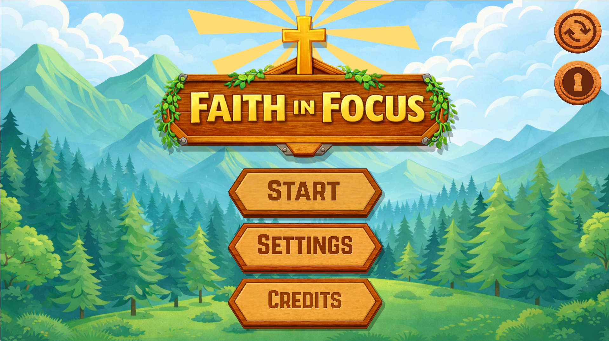
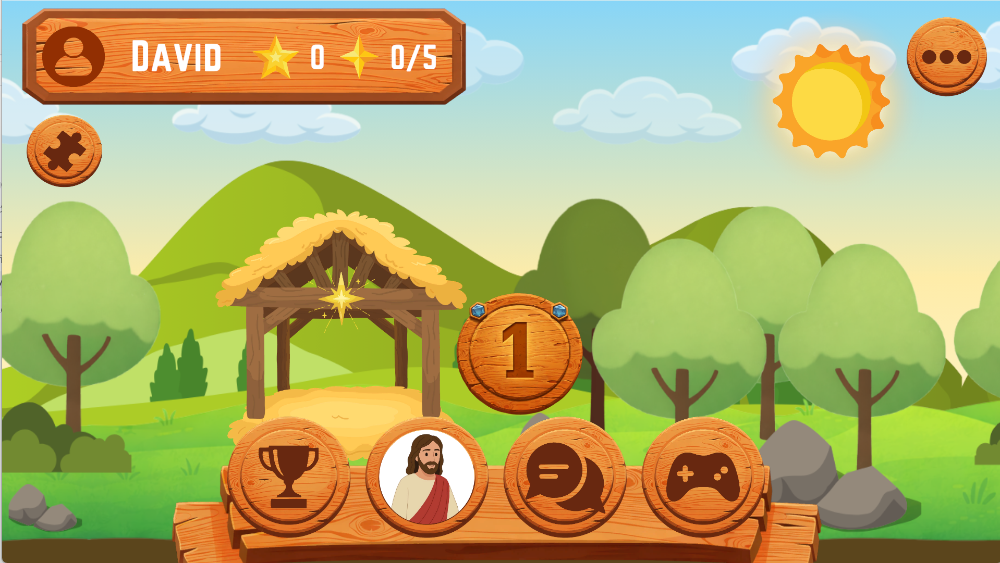
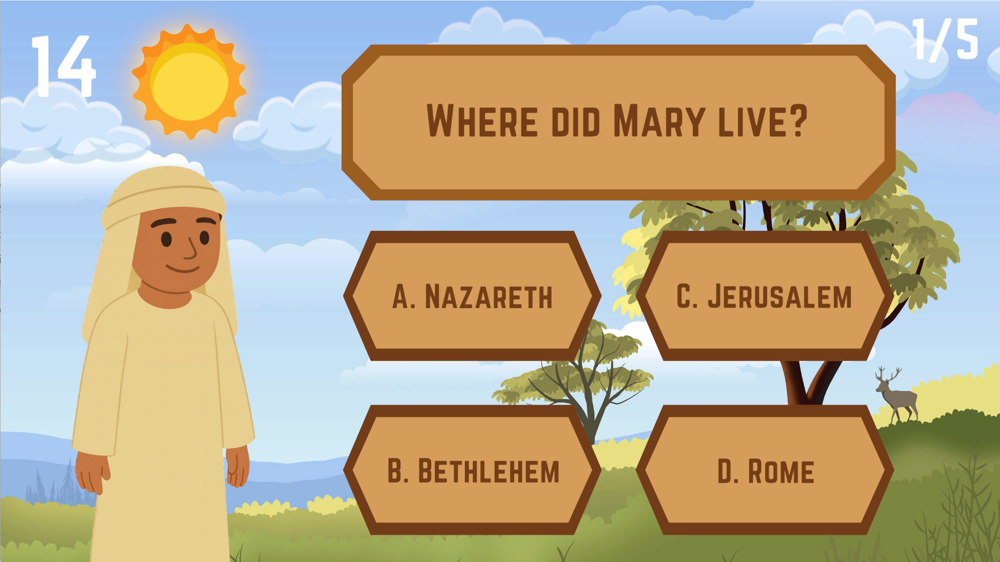
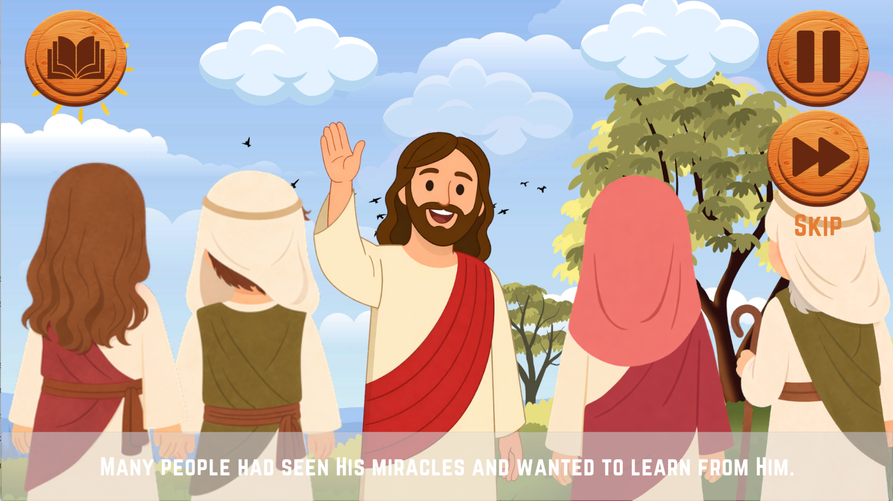
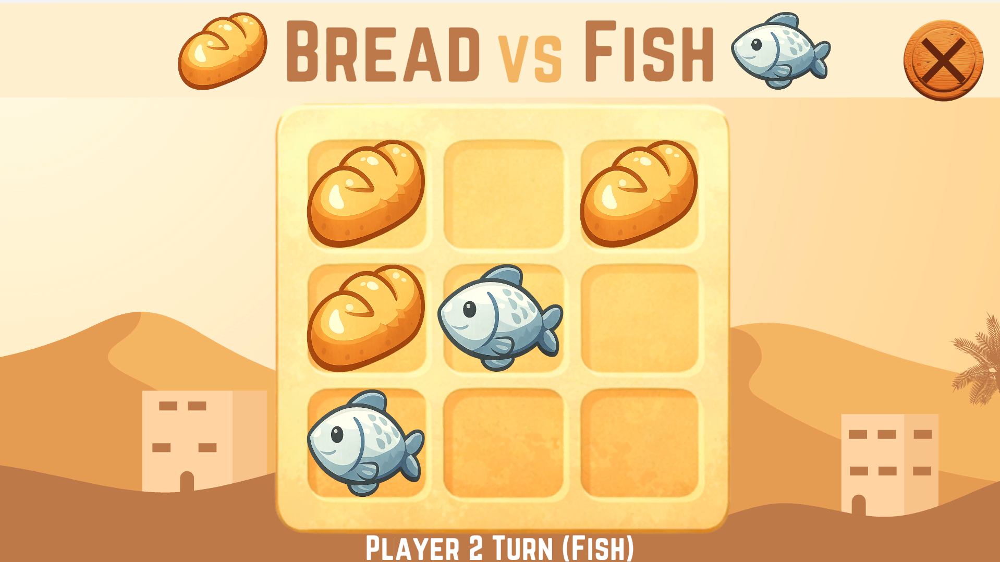

  

# Faith In Focus

> A cross-platform Christian educational game designed to help children learn biblical stories through interactive storytelling, quizzes, mini-games, and engaging learning experiences.

---

## Overview

Faith In Focus is a Christian educational application developed using Unity and C# for Android, Windows, and Web platforms.

Inspired by educational applications such as Bible App for Kids and Superbook, the project combines storytelling, gameplay, and biblical learning into a single interactive experience.

The application was successfully deployed and adopted within local church communities, where it has been used as a Bible learning tool for children and young learners.

---

## Downloads

### Windows Version

[Download for Windows](https://drive.google.com/drive/folders/1qeQex2pnboeVMjOqH4tNo6lqBnc-nMnT?usp=sharing)

### Android Version

[Download for Android](https://drive.google.com/drive/folders/1oqg3Iv4996bNbDjOEW45JADKqvb9O-0C?usp=sharing)

---

## Project Information

| Category | Details |
|-----------|---------|
| Project Type | Christian Educational Game |
| Platforms | Android, Windows, Web |
| Engine | Unity |
| Programming Language | C# |
| Target Audience | Children and Young Learners |
| Development Type | Solo Developer Project |
| Deployment Status | Successfully Deployed |

---

## Architecture

The application was built using a modular architecture separating gameplay systems, UI systems, and data management.

Core systems include:

- Story Progression Manager
- Quiz Manager
- Save System
- Mini-Game Framework
- Scene Navigation System
- Player Progress Tracking

The project follows reusable component-based development principles within Unity.

---

## Key Features

### Interactive Story Mode

Experience biblical stories through guided progression and visual storytelling.

### Animated Cutscenes

Story-driven scenes designed to improve engagement and biblical understanding.

### Bible Quizzes

Knowledge-based quizzes that reinforce learning through gameplay.

### Educational Mini Games

Interactive activities inspired by biblical themes and stories.

### Character Guides

Learn about important biblical figures through dedicated character information systems.

### Cross-Platform Support

Available on Android, Windows, and Web platforms.

---

## Screenshots

### Main Menu

### Adventure Mode

### Quiz System

### Storytelling Experience

### Mini Game

---

## Project Highlights

- Successfully deployed and used within local church communities as a Bible learning application for children and young learners.
- Designed specifically for children and young learners
- Combines education, storytelling, and gameplay
- Cross-platform support for Android, Windows, and Web
- Inspired by Bible App for Kids and Superbook
- Developed as a complete educational learning experience

---

## Gameplay Demo

Watch a short gameplay demonstration showcasing the story mode, quizzes, cutscenes, and mini-games.
  
🎥 Faith In Focus Gameplay Demo

[Faith_In_Focus_Demo](https://drive.google.com/file/d/1BGp7RXoxKcmjiXu8kLmdze78QgwiK3ku/view?usp=sharing)

---

## Technologies Used

- Unity Engine
- C#
- TextMeshPro
- Unity UI System
- Educational Game Development
- PlayerPrefs Save System
- Android and Windows Build Pipeline
- Git & GitHub

---

### Technical Contributions

- Designed and implemented gameplay systems in C#
- Developed reusable UI architecture using Unity UI
- Implemented PlayerPrefs save system
- Built quiz and story progression frameworks
- Developed cross-platform deployment pipeline
- Optimized mobile performance for Android devices

---

## Future Improvements

- Additional Bible Stories
- Expanded Mini Games
- Achievement System
- Cloud Save Support
- Additional Character Interactions
- Enhanced Educational Content

---

## Technical Challenges

During development, several technical systems were designed and implemented:

- Story progression system
- Interactive quiz framework
- Persistent save data using PlayerPrefs
- Educational mini-game architecture
- Cross-platform deployment for Android and Windows
- Responsive UI scaling across multiple resolutions

---

## Development Timeline

Duration:
4 Months

Role:
Solo Developer

Team Size:
1

Engine:
Unity

Language:
C#

---

## Developer

**David Nathaniel Miranda**

Software Developer | Unity Game Developer | Web Developer

GitHub:
[David Miranda GitHub](https://github.com/davidmiranda-gamedev)

LinkedIn:
[David Miranda LinkedIn](https://www.linkedin.com/in/david-nathaniel-miranda-1432b9274/)

---
